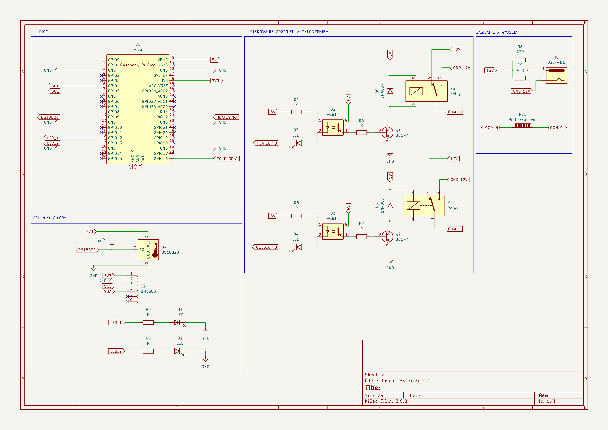
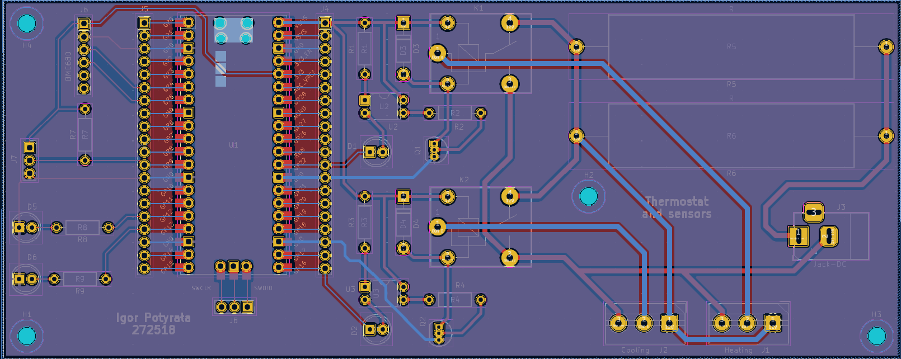
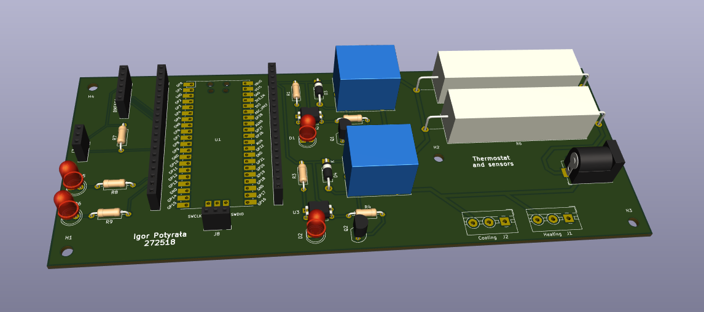

# Intelligent Thermostat

Hardware part of the thermostat project, made for Raspberry Pi Pico W to allow easier data gathering from sensors and control of temperature.

## Tools used

- Kicad
- C / C++
- CMake
- lwIP
- PicoSDK

## Schematics and PCB design

The schematic below is a simplified version of the schematic provided
inside the ```/hardware/``` folder.



<br>
<br>



<br>
<br>

